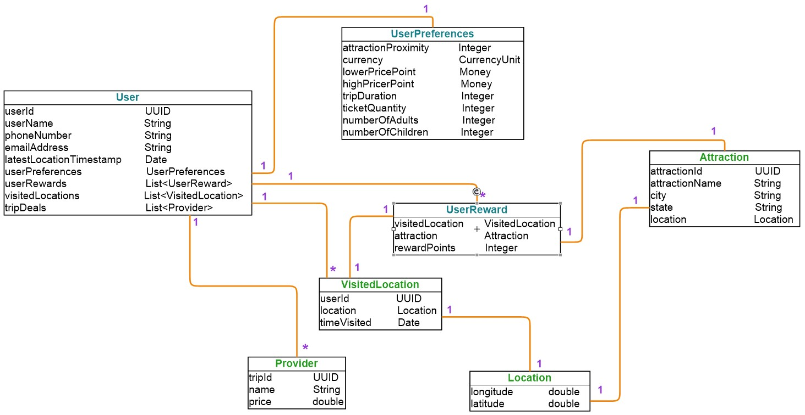

TourGuide V1.0
========================


Description
------------
TripMaster aims, with the TourGuide application, to change the rules of the game on how to obtain information 
on tourist attractions close to users, accompanied by promotional offers from tour operator partners.

**`TourGuide`**  is the micro-service centralizing requests and which is based on 3 other micro-services (gpsUtil, TripPricer, 
RewardsCentral). 
* **`GpsUtil`** : Returns the location of a user by his id and provides the list of attractions with their locations.
* **`TripPricer`** : Allows you to obtain 5 offers from 5 providers according to the preferences and discount points of the User.
* **`RewardsCentral`** : Allows the calculation of a user's discount for an attraction.

You will find below a diagram detailing their connection
## Prerequisites
### Technologies
- Spring Boot
- Spring MVC
- Spring Data JPA
- Hibernate

### Installing
Install Java:
* https://www.oracle.com/fr/java/technologies/javase-downloads.html

Install Gradle:
* https://gradle.org/

Install Docker:
* https://www.docker.com/products/docker-desktop

## Run the application

Once the project is in your favorite IDE. To make it work on Docker, since it has been installed beforehand, there are 2 steps.
* Build each micro-services, with gradle and run the command build under the root of each micro-sercices, this allows
you to launch the Dockerfile image construction diagrams 
  * $ docker build -t NAME_OF_YOUR_IMAGE .
* 2nd step, build the Docker-compose.yml of TourGuide with the command that creates and start containers
  * $ docker-compose up
  
Then you can test the endpoints with Postman for example.
  * https://www.postman.com/downloads/
  

## Modelization
###  Class Diagram

###  TourGuide Architectural Overview


## ENDPOINTS
``` 
Index
```
- **GET** http://localhost:9000/
```
user's localisation
```    
- **GET** http://localhost:9000/getLocation
     - ex:  http://localhost:9000/getLocation?userName=internalUser77
```
Location of all users
``` 
- **GET** http://localhost:9000/getAllCurrentLocations

```
List of 5 provider offers for an attraction
``` 
- **GET** http://localhost:9000/getTripDeals
    - ex: http://localhost:9000/getTripDeals?userName=internalUser77
```
List of the 5 attractions closest to the user with their locations and the distance between them
``` 
- **GET** http://localhost:9000/getNearbyAttractions
    - ex: http://localhost:9000/getNearbyAttractions?userName=internalUser77
```
detail of a user
```    
- **GET** http://localhost:9000/getUser
    - ex:  http://localhost:9000/getUser?userName=internalUser77
```
detail of user's references
```    
- **GET** http://localhost:9000/getUserPreferences
    - ex:  http://localhost:9000/getUserPreferences?userName=internalUser77
```
UpDate of user's references
```    
- **PUT** http://localhost:9000/addUserPreferences
    - ex:  http://localhost:9000/addUserPreferences?userName=internalUser77
    - With a json body 
      - ex: {
          "attractionProximity": 300,
          "lowerPricePoint": 100,
          "highPricePoint": 600,
          "tripDuration": 6,
          "ticketQuantity": 4,
          "numberOfAdults": 2,
          "numberOfChildren": 1
          }